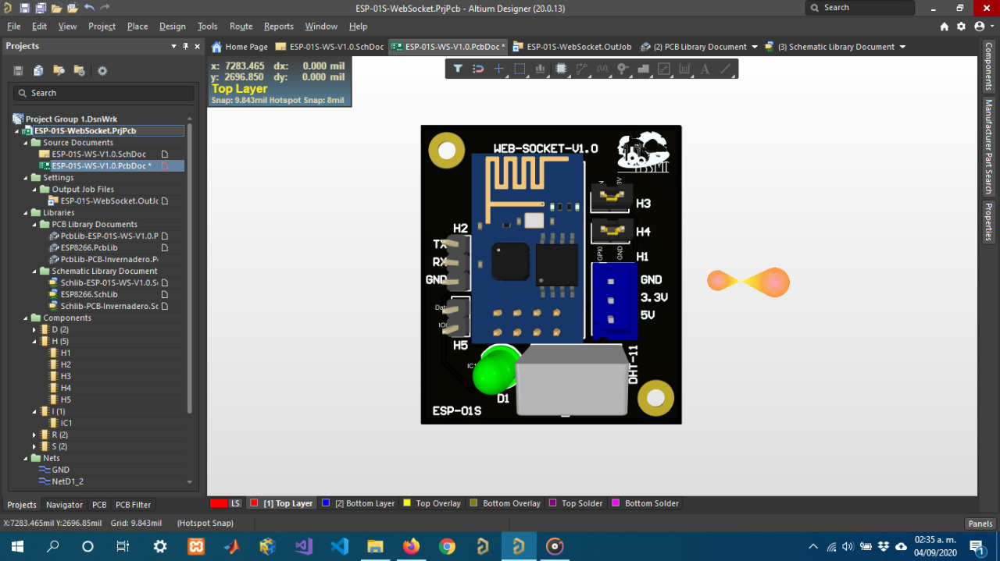
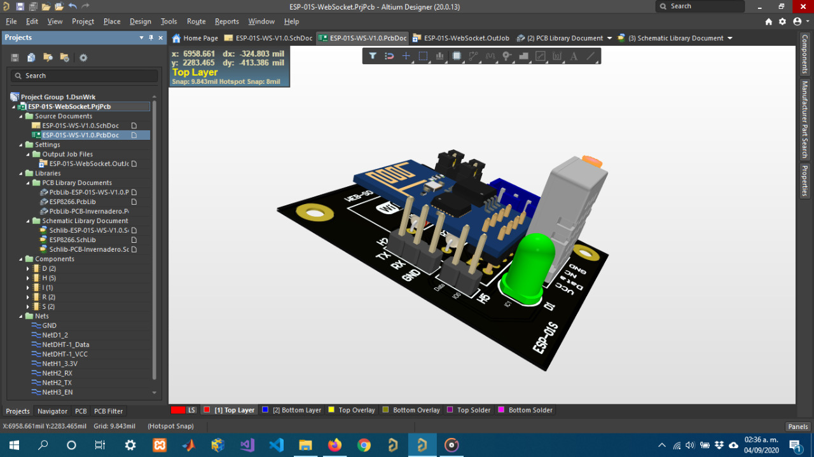

    

        <H1>ESP-01S-WS</H1>
    
    
    

        <H1>Avances</H1>
        <pre style = "color:write">
            [x] HTML
            [x] JavaScript
            [x] Diseño PCB (Altium)
            [x] DashBoard Local
            [ ] DashBoard Externo
            [ ] Conexión Base de datos
        </pre>
    
    
    

                
              
    

